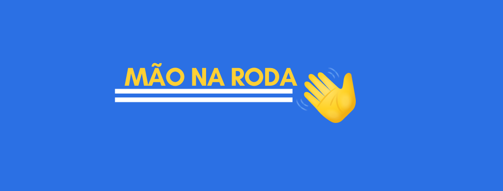

 Links que são uma mão na roda para o desenvolvimento de projetos e evolução do aprendizado.

<h4 align="center"> 👋 Mão na Roda  •🚧 Em construção 🚧•</h4>

 

 <a href="#sobre">Sobre o projeto</a> •
 <a href="#links">Links</a> • 
 <a href="#contribuidores">Contribuidores</a>• 
 <a href="#licenca">Licença</a> • 

<h2 id="sobre">💻  Sobre o projeto</h2>

  O Mão na Roda disponibiliza links que irão te auxiliar no desenvolvimento 
  de projetos sendo sua maioria links com acesso gratuito.  

<h2 id="links">🔍Links</h2>

   Visite a página <a href="https://github.com/IzabellaLoyse/mao-na-roda/blob/main/links.md">Links</a> para conhecer a lista completa.

<h2 id="contribuidores">📌Contribuidores</h2>
<table>
<tr>

<td align="center"> <a href="https://github.com/IzabellaLoyse">

 
<b>Izabella Loyse</b>
</a>
 
 <a href="https://github.com/IzabellaLoyse/mao-na-roda/commits?author=IzabellaLoyse" title="Code">💻</a><a href="#features-izabellaloyse" 
 title="Ideas, Planning, & Feedback">🤔</a> 
 <a href="#infra-izabellaloyse" title="Infrastructure">🚇</a>
 <a href="#design-izabellaloyse" title="Designer">🎨</a> 
 </td>

</tr>
</table>

<h2 id="licenca" >📝 Licença</h2>

Este projeto está sobe a licença <a href="https://github.com/IzabellaLoyse/mao-na-roda/blob/main/LICENSE.md">MIT</a>

